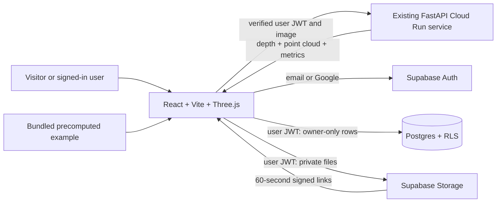

# Depth Wizard: Existing Supabase project and public-readiness guide

**Current release instructions:** use the existing Depth Wizard Cloud Run service and Supabase project. Do not create another project or rerun `supabase/setup.sql`. The public-readiness changes are on the `codex/depth-wizard-public-safety` branch; the additive migration is still unapplied. Follow [DEPLOYMENT.md](../DEPLOYMENT.md) for the current branch, security gates, and unverified production prerequisites. Cloud Run access stays private until the user explicitly types `GO PUBLIC`.

Guests can use the precomputed browser demo; all cloud image processing requires a verified signed-in account. This guide describes the existing project and service. Do not create a replacement project, rerun the original schema script, or follow old demo steps that assume guests can run inference.

## 1. What needs an account?

| Feature | Login/database needed? |
| --- | --- |
| Explore the bundled precomputed map and interactive 3D view | No. Guests do not run inference. |
| Upload an image and run model inference | Yes: a verified signed-in Supabase account. |
| Export the current result | No. |
| Save and reopen personal analyses on another device | Yes: Auth + Postgres + private Storage. |
| Change display name, delete saved analyses | Yes; only the owner. |
| Admin dashboard or roles | Not needed for this prototype. There is no user-editable role field. |

The SIH story should focus on the image-to-depth-to-3D workflow. A single monocular image gives relative depth; choosing a scale preset does not establish real metric accuracy. Use measured ground-control points for calibration and label sample terrain as illustrative. Supabase stores results; it does not run the Python model or host this Vite frontend.

## 2. Existing Supabase project

The release uses the existing project `depth-wizard` (`jricazzvfyqghbavsaqa`) and its existing private `depth-wizard` bucket. Keep its current region, data, and policies. Do **not** create another project or rerun `supabase/setup.sql`; it is the original bootstrap script, not the public-readiness migration.

Use the existing project's Connect/API settings to verify the Project URL and public publishable key (`sb_publishable_...`). The browser only receives that public key. Never put `service_role`, `sb_secret_...`, a database password, or a JWT signing secret in Vite. The server quota and account-management paths require the service-role key in the existing Cloud Run service's Secret Manager binding. Run Security Advisor and confirm both public tables retain RLS; do not disable RLS to fix an empty screen.

The additive migration `supabase/migrations/20261003164056_public_analysis_safety.sql` is not yet applied to the live project. Review and validate it against the existing schema in isolation first, then use the approved migration workflow. Do not substitute or edit the original setup script.

Current docs list **500 MB database per project**, **1 GB Storage**, and **5 GB egress** on Free; several allowances are shared across the organization. Verify your dashboard and the [official billing table](https://supabase.com/docs/guides/platform/billing-on-supabase) before evaluation because limits can change. This implementation uses no paid Supabase feature.

### Environment files

For the current existing Cloud Run service, preserve the environment and secret bindings, then configure only the variables in the reviewed release plan. Never copy the service-role key into a local browser env file or any `VITE_` variable. For local Supabase development, the server settings are:

```dotenv
AUTH_PROVIDER=supabase
SUPABASE_URL=https://YOUR_PROJECT.supabase.co
SUPABASE_PUBLISHABLE_KEY=sb_publishable_YOUR_KEY
MAX_USER_DAILY_ANALYSES=5
MAX_IP_ANALYSES_PER_MINUTE=5
MAX_GLOBAL_DAILY_ANALYSES=50
MAX_USER_STORAGE_MB=50
UPLOAD_RETENTION_DAYS=365
MAX_IMAGE_MB=20
MAX_IMAGE_PIXELS=25000000
INFERENCE_CONCURRENCY=1
MAX_INFERENCE_WAIT_SECONDS=10
TRUSTED_PROXY_HOPS=0
ALLOWED_ORIGINS=http://localhost:5173,http://127.0.0.1:5173,http://localhost:8000,https://YOUR-TUNNEL.trycloudflare.com
# Set SUPABASE_SERVICE_ROLE_KEY only as a server Secret Manager binding.
# ENABLE_BATCH_ANALYSIS=false
# ENABLE_VIDEO_ANALYSIS=false
# PUBLIC_DEMO_ONLY=false
```

Copy `frontend/.env.supabase.example` to `frontend/.env.local` and fill:

```dotenv
VITE_AUTH_PROVIDER=supabase
VITE_SUPABASE_URL=https://YOUR_PROJECT.supabase.co
VITE_SUPABASE_PUBLISHABLE_KEY=sb_publishable_YOUR_KEY
VITE_SUPABASE_GOOGLE=false
```

Blank URL/key values are supported for local precomputed-demo development; they do not enable anonymous cloud inference. `.env`, `.env.local` and `.env.*.local` are ignored by Git. All `VITE_` values are public after build. Changes require restarting Vite or rebuilding production. The Python server reads the root `.env`; frontend values are separate.

### Email and optional Google

Keep the Email provider enabled, with email confirmation off as requested, so
new signups can sign in without email confirmation. Public password-reset email
delivery still depends on the configured SMTP provider.

The built-in SMTP service currently sends only to authorized organization-team addresses, is limited to about **2 emails/hour**, and has no delivery SLA. Do not add public users as organization members to work around this. If public password-reset delivery is needed, configure a provider that can deliver to public addresses and test reset delivery. [Email restrictions](https://supabase.com/docs/guides/auth/auth-smtp)

The existing Auth CAPTCHA switch was observed off during this review. This release leaves it off and does not request provider keys or CAPTCHA tokens.

For the public Cloud Run release, keep Site URL set to `https://depth-wizard-133290700595.asia-south1.run.app` and allow `https://depth-wizard-133290700595.asia-south1.run.app/**`. These values already exist in the current project's Auth URL Configuration. Local development may additionally use these redirect URLs (replace the tunnel name):

```text
http://localhost:5173/
http://localhost:5173/?reset=1
http://127.0.0.1:5173/
http://127.0.0.1:5173/?reset=1
http://localhost:8000/
http://localhost:8000/?reset=1
https://YOUR-TUNNEL.trycloudflare.com/
https://YOUR-TUNNEL.trycloudflare.com/?reset=1
```

The app uses its current origin by default; `VITE_AUTH_REDIRECT_URL` can pin one origin. Update both redirect settings and CORS when a quick tunnel changes. Avoid broad production wildcards. Open confirmation/reset links in the browser that started the PKCE flow. [Redirect URLs](https://supabase.com/docs/guides/auth/redirect-urls)

Google is optional and disabled by default. To enable it, configure a Google OAuth web client, add Supabase's displayed callback URL (`https://YOUR_PROJECT.supabase.co/auth/v1/callback`) to Google's authorized redirect URIs, add your frontend origin to Google's JavaScript origins, enter the client ID/secret in Supabase's Google provider settings, and set `VITE_SUPABASE_GOOGLE=true`. Keep Google's client secret in Supabase, never Vite. Test with any consent-screen test-user restrictions before the demo. [Google setup](https://supabase.com/docs/guides/auth/social-login/auth-google)

## 3. Run locally and through your tunnel

Install the existing dependencies if needed:

```powershell
cd D:\depth-wizard
.\.venv\Scripts\python.exe -m pip install -r backend/requirements.txt
cd frontend
npm ci
```

Start the backend in one terminal, from the project root:

```powershell
.\.venv\Scripts\python.exe -m uvicorn app.main:app --app-dir backend --host 127.0.0.1 --port 8000 --no-proxy-headers
```

Start Vite in another:

```powershell
cd D:\depth-wizard\frontend
npm run dev -- --host 127.0.0.1 --port 5173 --strictPort
```

Visit `http://localhost:5173`. For the visible development session created by Codex, an older server already occupied 8000, so the new cloud-mode server uses **8001** and Vite's process environment has `DEPTH_API_PROXY=http://127.0.0.1:8001`. This avoids stopping your existing server. Normal setup uses 8000 as above.

For a stable single-origin tunnel demo, build after adding frontend variables:

```powershell
cd D:\depth-wizard\frontend
npm run build
cd ..
.\.venv\Scripts\python.exe -m uvicorn app.main:app --app-dir backend --host 127.0.0.1 --port 8000 --no-proxy-headers
# In another terminal, using your installed cloudflared:
cloudflared tunnel --url http://localhost:8000
```

FastAPI serves `frontend/dist` and `/api` from one origin. Add the resulting tunnel origin to `.env` CORS and Supabase Auth redirects, then restart the backend. A static host can serve `frontend/dist`, but it still needs an HTTPS FastAPI endpoint through `VITE_API_BASE`; rebuild with that URL and allow the frontend origin on the backend. Supabase Free does not keep the local model process or tunnel running.

## 4. Database and Storage design

`supabase/setup.sql` contains every table, index, trigger, grant and policy. No Firebase configuration is needed.

| Resource | Content and limits |
| --- | --- |
| `profiles` | Auth user ID, display name (100 characters), creation time. Auth trigger creates it and backfills existing users. |
| `analyses` | Owner, filename, model, paths, raw normalized height metrics including transects/histogram, report JSON, scale preset/factor, status and timestamp. Each JSON object is capped at 64 KiB. |
| Private Storage | `user_id/analysis_id/input.png` (or jpg/webp/tif), `depth.png`, `preview.jpg`, `cloud.json`, optional `cloud.ply`. |
| Index | `(user_id, created_at desc, id)` supports ownership-filtered newest-first pages. Primary keys provide ID indexes. |

`cloud.json` stores the downsampled point cloud so reopening restores 3D without another inference request. Images/base64 arrays stay out of Postgres. Current cloud history stores the server-returned resized JPEG as the saved source; the raw uploaded image and its original EXIF/GPS metadata are not uploaded to Storage. PLY is binary and uses relative coordinates; apply the saved `scale_factor` in your 3D tool. Scaled values are derived from raw metrics and the separately stored factor. Click **Save current scale** after choosing a preset or calibrating.

All normal reads are one-shot requests, with 10 rows per history page and no realtime subscription. Uploads use `upsert:false`. Signed URLs expire after 60 seconds; they work for whoever holds the link during that interval, so they are not logged or stored in rows. Reopening obtains fresh links. [Private buckets](https://supabase.com/docs/guides/storage/buckets/fundamentals), [upload restrictions](https://supabase.com/docs/guides/storage/buckets/creating-buckets)

RLS restricts every row to `auth.uid() = user_id`; column grants prevent changing owners, paths and timestamps. Profile edits only change display names. Storage requires the owner folder plus a matching reserved analysis path; arbitrary uploads are blocked. There is no broad public-read or file-update policy. Internal trigger functions have locked search paths and are inaccessible through the public API.

Save reserves an `uploading` row, uploads files, then marks it `ready`. Delete marks it `deleting`, removes files via Storage API, then removes the row. If networking fails, an incomplete history entry remains so **Delete** can retry. A database trigger prevents normal row deletion while its files remain. These are multiple HTTP operations, not a distributed transaction: avoid overlapping save/delete on the same entry and inspect interrupted operations before evaluation. Delete all analyses first before deleting an Auth user; otherwise the file-check trigger deliberately blocks the cascade.

The existing database serializes per-user history reservations and rejects more than **20** rows, including incomplete entries. On the next save, the UI first deletes the oldest analysis. This is a rolling-history policy: a subsequent upload failure does not restore that old entry. A separate storage-accounting trigger enforces the configured per-user byte limit for the current public-readiness release.

Monitor Storage and egress usage in the existing project's dashboard. Signed downloads consume egress; avoid repeatedly refreshing large histories. Do not enable Realtime or image transformations for this workflow unless the app begins using them.

## 5. Code map and backend identity

| File | Responsibility |
| --- | --- |
| `frontend/src/supabase/client.js` | Modular supabase-js v2 client, PKCE, persistent sessions and refresh. Version pinned in package.json/lock. |
| `frontend/src/supabase/CloudAuthProvider.jsx` | Signup/login/logout, auth state listener, precomputed demo selection, password reset/change, Google. |
| `frontend/src/components/LoginPage.jsx` | Forms, loading/error messages, precomputed demo entry. |
| `frontend/src/main.jsx` | Protected history-capable app entry; demo entry uses only bundled precomputed results. |
| `frontend/src/api.js` | Attaches access JWT to FastAPI; keeps binary exports working. |
| `frontend/src/supabase/analyses.js` | Save/prune/cleanup, signed downloads, full-result reconstruction and profile updates. |
| `frontend/src/components/AnalysisHistory.jsx` | List/open/delete, PLY download and display-name edit. |
| `backend/app/supabase_identity.py` | Server-side verification; cloud analysis has no guest identity. |

For ES256/RS256, FastAPI verifies signatures against the configured project's JWKS, with issuer, audience, expiry, subject and role checks. Cached public keys expire after five minutes. For legacy HS256 projects, it asks the Auth server `/auth/v1/user` using the publishable key; it never uses a shared signing secret. Bad Bearer tokens receive 401 rather than silently becoming guests. A verification outage receives 503. JWT validation alone does not immediately detect every user deletion or logout until token expiry. [Official JWT verification guidance](https://supabase.com/docs/guides/auth/jwts)

Cloud analysis requires verified identity and reserves shared per-user, per-IP, and global quotas in Postgres before inference. Batch and video are disabled by default; batch remains disabled in Supabase mode because the existing job store is local SQLite.

Guests do not invoke cloud analysis. Local-mode saved history and users are separate from Supabase; there is no automatic migration of previous local accounts or records.

## 6. Keep the Free project available and back it up

Free projects with low activity over a seven-day period may be paused. Check the project's dashboard status before rehearsals and use **Restore/Resume** if paused, then wait for Auth, REST and Storage to respond. Check the dashboard's current restoration options; do not rely on indefinite paused-project retention. Free hosting offers no uptime guarantee. [Production checklist](https://supabase.com/docs/guides/deployment/going-into-prod)

`.github/workflows/supabase-health.yml` runs a database health RPC every two days and supports manual dispatch. To use it, push it to your GitHub repository's default branch and add repository Actions secrets `SUPABASE_URL` and `SUPABASE_PUBLISHABLE_KEY`. No service key is required; the RPC returns only `1`. Enable Actions and run it manually once. **This file has not been deployed or scheduled by Codex.** Scheduled activity is best-effort, cannot guarantee avoiding Supabase pause, and cannot restore a paused project. GitHub may delay schedules and disables inactive public-repository schedules after 60 days. Verify [GitHub schedule behaviour](https://docs.github.com/en/actions/reference/workflows-and-actions/events-that-trigger-workflows#schedule) and Supabase policy before relying on it.

Back up before evaluation and before deleting anything:

1. With PostgreSQL client tools installed, use the database connection details from Supabase's Connect dialog. Prefer its session-pooler connection when your network cannot reach the direct IPv6 endpoint. Use a `pg_dump` version compatible with the project's PostgreSQL server.
2. Run this in PowerShell, filling non-secret host/user/database values. `-W` prompts for the password instead of putting it in shell history:

```powershell
New-Item -ItemType Directory -Force D:\depth-wizard\.scratch\backups | Out-Null
pg_dump -h YOUR_SESSION_POOLER_HOST -p 5432 -U postgres.YOUR_PROJECT_REF -d postgres -W -Fc --no-owner --no-acl -f D:\depth-wizard\.scratch\backups\database.dump
pg_restore --list D:\depth-wizard\.scratch\backups\database.dump
```

3. Database backups contain Storage metadata, **not object bytes**. For an independent app-row and file copy, set server-only `SUPABASE_URL` and `SUPABASE_SECRET_KEY` in an ignored `frontend/.env.backup.local` on your own machine, then run:

```powershell
cd D:\depth-wizard\frontend
node --env-file=.env.backup.local scripts/backup-supabase.mjs
```

The script paginates rows/folders and writes JSON plus private file bytes beneath `.scratch/backups/TIMESTAMP`. It is an administrative script, never part of Vite. Do not send that env file or backups to judges. Copy the resulting backup to a protected external drive. Stop writes while making a consistent demo backup. Validate counts and open several copied images; rehearse restore into a disposable project before relying on it. A full Supabase restore must also account for Auth users, ownership IDs, schema, and Storage API reupload; copying application JSON alone is not a full restore. [Backup limitations](https://supabase.com/docs/guides/platform/backups)

## 7. Demo accounts and failure plan

In Auth → Users, create two confirmed demo accounts using email aliases your team controls. Give each a different random password and no administrative privileges. Do not publish passwords in this repository. Distribute them privately on judge cards if needed. These accounts have **not yet been created**, since you chose configuration-first setup.

Log in with test accounts and verify only in an isolated environment. Bundled **ISRO Crater Terrain**, **Indian Cityscape Drone**, and **Mountain Terrain** previews are precomputed and clearly illustrative; they do not demonstrate a new model run. Do not create test accounts or seed the live project without a release decision.

If internet fails, use the existing local development setup with cached model weights. Local inference can be tested with a local account; the public cloud flow requires online Supabase Auth and history. **Open offline demo (precomputed)** displays bundled results without inference and is visibly labelled precomputed. Server operations such as inference, contour/volume services, calibration and some exports require FastAPI. The production service worker caches the demo and visited static assets; open the offline demo and 3D view before going offline. Development Vite does not install that service worker.

For results-day availability, monitor the existing Cloud Run and Supabase services, keep redirect URLs current, and check usage daily. No Free-plan setup can promise uninterrupted availability through an unspecified results date.



## 8. Testing checklist and fixes

Local automated checks:

```powershell
cd D:\depth-wizard
$env:PYTHONPATH='backend'
.\.venv\Scripts\python.exe -m pytest backend/tests -q
.\.venv\Scripts\python.exe -m ruff check backend/app backend/tests --select F
cd frontend
npm test
npm run build
```

The SQL tests run PostgreSQL via PGlite with minimal Auth/Storage schema stubs. They execute setup twice, test two users, owner immutability, allowed paths, JSON validation, deletion ordering and the 20-row cap. They do not emulate hosted email, Google OAuth, Storage HTTP behaviour or network races.

After configuration, create `frontend/.env.test.local` with `SUPABASE_URL`, `SUPABASE_PUBLISHABLE_KEY`, `TEST_A_EMAIL`, `TEST_A_PASSWORD`, `TEST_B_EMAIL`, `TEST_B_PASSWORD`. Use two empty disposable accounts. Run:

```powershell
node --env-file=.env.test.local scripts/test-supabase-live.mjs
```

This creates one test analysis, checks cross-user read/update/delete and private-file access, then deletes that test entry. Never use production user accounts. It has not been run against a hosted project yet.

Day-before checklist:

- Signup with confirmation setting as intended; log in, log out, log in again and refresh. Use an incognito window for the second user.
- Request reset with an actual deliverable email; open the link in the initiating browser, set a new password and log in with it. Test expired links and a rejected password.
- If enabled, test Google login on the final tunnel origin. Test logout and session refresh after waiting for access-token renewal.
- Guest: open the precomputed demo, fly through, export, and confirm no private history appears. The guest flow does not run model inference.
- Signed in: save, reopen full 3D, change/save scale, edit name, optionally download PLY, delete and confirm both row and files are gone.
- User B cannot query/edit/delete User A's row or sign/download A's Storage path. SQL Editor as owner bypasses RLS: use the live SDK test, not an owner SQL query, to demonstrate isolation.
- Interrupt a save/delete; confirm the incomplete entry can be removed. Test a >2 MiB original: inference succeeds but cloud saving explains the limit.
- Test 20 entries on a disposable account, then another: the UI prunes the oldest; a direct 21st reservation is rejected. Verify the database-backed per-user, per-IP and global analysis limits reject excess signed-in requests.
- Run a real model inference, check free quotas, resume any paused project, verify backups, rehearse the offline button and keep chargers/tunnel ready.

| Symptom | Fix |
| --- | --- |
| Cloud history is not configured | Verify the two Vite public variables, project status and Auth configuration, then rebuild. The precomputed demo remains available; cloud analysis requires sign-in. |
| Login succeeds, profile/history fails | Run all SQL; confirm trigger/backfill, table grants and RLS. Check dashboard logs. Never use a service key to bypass the UI error. |
| Empty reads / RLS violation | Check the current signed-in UID, owner column, reserved path and `uploading` status. Old local IDs are not Supabase UUIDs. |
| Invalid redirect / PKCE verifier missing | Match exact scheme/host/port/path/query, update tunnel URLs, use the initiating browser and request a fresh link. |
| No reset/confirmation email | Check SMTP recipient restrictions, rate limits, spam folder and delivery logs. Configuration OFF only skips signup confirmation, not reset delivery. |
| 401 / expired session | Log in again; check backend project URL matches Vite. Verify signing-key rotation and clock. Do not strip an invalid token and pretend it is a guest. |
| 503 verifying login | Verify project status, server internet and JWKS/Auth endpoint availability. Only the bundled precomputed demo is available without a verified cloud identity. |
| CORS / Origin not allowed | Add the exact frontend origin to ALLOWED_ORIGINS and restart FastAPI. Different ports and localhost vs 127.0.0.1 are different origins. |
| Upload too large / quota | Use an original below 2 MiB, omit PLY, delete old results through the app and check organization usage. |
| Download link expired | Reopen history to obtain a fresh signed link. |
| Delete fails | Retry; files must be removed before the row. Keep the incomplete entry until cleanup succeeds. |
| Missing relation/index | Confirm the original schema is present and review the pending additive migration. Do not rerun `supabase/setup.sql` on the existing project. Postgres does not use Firebase-style generated-index links; verify the index exists in Database → Indexes. |

Current APIs and quotas were checked against official Supabase docs during implementation. Recheck those linked pages and the [changelog](https://supabase.com/changelog) when your evaluation approaches.
